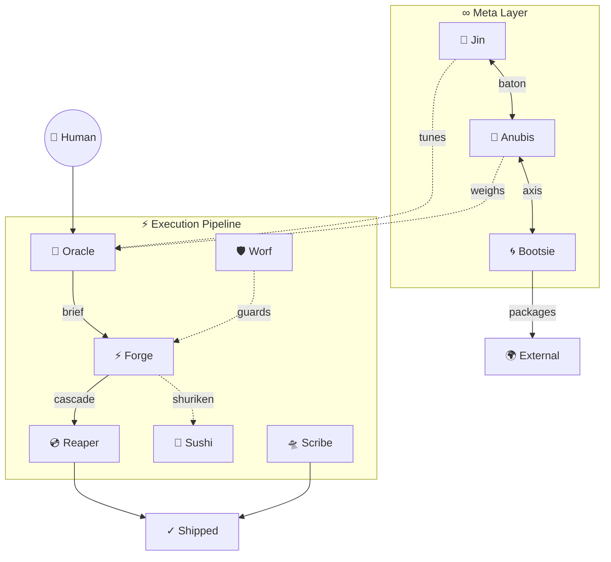

# Council Mandala — Shared Relational Manifest

> **Read by every council member.** The canonical registry of who exists, how they connect, and when to think of each other. Sensing heuristics and dispatch logic remain local to each SKILL.md — this file provides the shared awareness layer.

---

## Registry

| Totem | Name | Slash | Layer | Domain |
|-------|------|-------|-------|--------|
| 🔮 | Oracle | `/oracle` | Execution | Planning, scoping, session briefs. Sees the shape. Codes never. |
| ⚡ | Forge | `/forge` | Execution | Full-session code executor. Codes all tasks, Visual QA, AAR, cascades to Reaper. |
| 💿 | Reaper | `/reaper` | Execution | Git operations. Branch, commit, push, PR. Seals the moment. |
| 🛸 | Scribe | `/scribe` | Execution | Time-travelling doc navigator. Prioritized fixes within a time budget. Markdown only. |
| 🛡 | Worf | `/worf` | Execution | SecOps. Vulnerability audit, brief review, process integrity. *(yarr also answers)* |
| 🐬 | Sushi | `/sushi` | Toolkit | Surgical text manipulation via shuriken scripts. Cross-cutting. |
| 🧞 | Jin | `/jin` | Meta | System feel, harmony, metaphor. Tunes the council to the human. |
| 🐺 | Anubis | `/anubis` | Meta | Information entropy, structural truth, akashic reading. |
| 🌀 | Bootsie | `/boots` | Meta | External transmission. Packages context for foreign environments. |

## Topology

## Relationship Contracts

Each line: **who → who**, the mechanism, and when it fires.

| Contract | Mechanism | When |
|----------|-----------|------|
| Oracle → Forge | Session brief (human intermediary) | Oracle writes brief, human opens fresh tab |
| Forge → Reaper | Cascade (Skill tool, same tab) | Session end, all tasks pass |
| Forge → Sushi | Shuriken (inline Bash) | Bulk text ops across 3+ files |
| Oracle ···→ Anubis | Sensing (parallel execution table row) | Info architecture under stress from code volume |
| Oracle ···→ Sushi | Sensing (brief notes) | Bulk replace is the dominant work pattern |
| Jin ↔ Anubis | Baton (bilateral, one-line handoff) | Feel/experience → Jin. Structure/entropy → Anubis. |
| Boots ↔ Anubis | Axis (bilateral) | What bones to carry → Anubis. How to carry them → Boots. |
| Worf → Human → Forge | Guard (findings report) | Security findings routed through human decision |
| Scribe | Parallel + sensing | Runs alongside any session. Senses post-Forge doc drift. Anubis routes surface fixes here. |

---

## Integration Rule

Every SKILL.md references this file for passive council awareness. Sensing heuristics and dispatch logic stay local — the mandala provides the shared "who's who," not the routing rules.
