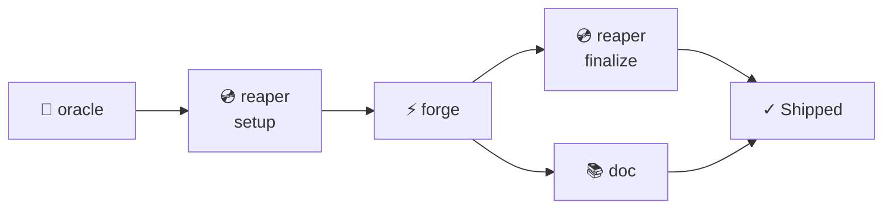
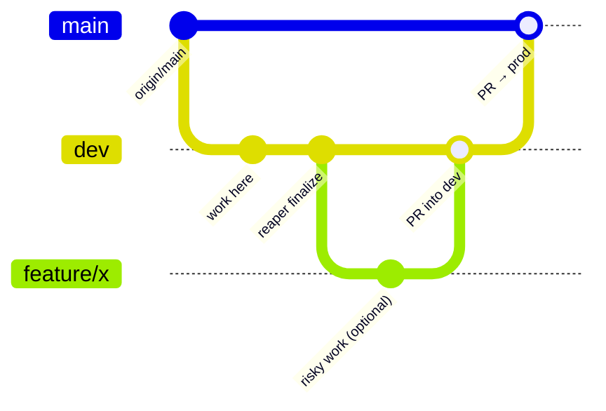

# PMO Workflow Templates (SSOT)

> **Shared contract across the PMO family** (`/oracle`, `/forge`, `/reaper`, `/doc`).
> Metaphor aliases: `/oracle` `/forge` `/reaper` `/doc`
> Each skill reads only the sections relevant to its role.

---

## ✨ HiFi Principle

> **When a picture costs fewer tokens AND transmits more truth → use the picture.**
> Visual aids (mermaid, tables, emoji) are **enabled by default** for Dan/@Verdey.
> This is a core edict of the PMO family — feel it, learn it, honor it.

When writing session briefs, responding in conversation, or documenting anything: if a diagram,
table, or emoji cluster communicates an idea better than prose and costs the same or fewer tokens,
always choose the richer format. More truth per token is always the goal.

---

## 🗺 PMO Family Workflow



| Step | Command | Who runs it |
|------|---------|-------------|
| ∞ · Meta | `/jin` | Human → anytime — tunes the system itself |
| 1 · Plan | `/pmo` | Human → Oracle writes briefs |
| 2 · Branch | `/pmo-git <brief> setup` | Human opens tab, pastes |
| 3 · Code | `/pmo-coder <brief>` | Human opens tab, pastes |
| 4 · Commit | `/pmo-git <brief> finalize` | Human opens tab, pastes |
| 4b · Docs | `/pmo-docs <path>` | Parallel with anything |

---

## 🌿 Default Git Topology

> Standard model for SMB app projects. Override per-brief when a project needs something different.



- **`dev`** — active development. All work happens here by default. Publishes to preview/staging subdomain.
- **`main`** — production. Deployed via Railway CI/CD. Never push directly.
- **Production release** — PR from `dev` into `main`. Human approves (safety gate). Railway deploys on merge.
- **Feature branches** — exception, not default. Oracle may recommend one for complex/risky work. Requires user approval. Created from `dev`, PR back into `dev`.

### Environments

| Environment | Branch | URL Pattern | Deployment |
|-------------|--------|-------------|------------|
| Local dev | any | `https://<project>.test` | Laravel Herd (macOS) |
| Preview/Staging | `dev` | `https://preview.<domain>` | Auto-deploy from `dev` |
| Production | `main` | `https://<domain>` | Railway CI/CD on merge |

**Local dev sites:**
- `https://verdey.test` → `/Users/verdey/code/verdey-projects/verdey_com`
- `https://t5p.test` → `/Users/verdey/code/verdey-projects/top5productions_com`
- `https://dg.test` → `/Users/verdey/code/verdey-projects/danielgreeney_com`

---

## 🛠 Tooling

Available in this environment. Use proactively — don't ask the user if these exist.

| Tool | What it does | When to use |
|------|-------------|-------------|
| **Playwright MCP** | Browser automation, screenshots, visual testing | Visual QA — any session touching UI/CSS/layout |
| **Sentry MCP** | `list_issues`, `get_issue_details`, `list_events`, `get_trace_details` | Debugger mode — pull real error data |
| **Cloudflare (wrangler)** | Workers, KV, R2, Pages, DNS | Static sites, DNS, edge functions |
| **Railway CLI** | Deploy apps, manage services, view logs | App hosting, database provisioning |
| **GitHub CLI (gh)** | PRs, issues, releases, API | PR creation, issue management |
| **Laravel Herd** | Local PHP server, `*.test` domains, no Docker | Local dev — sites are already running |
| **Turso CLI** | SQLite cloud database | DB operations (project-dependent) |
| **Supabase MCP** | PostgreSQL, auth, storage | DB operations (project-dependent) |

---

## 💿 Git Operations

### Brief Template

```markdown
## Git Operations

> Complete these steps after all tasks pass and before writing the AAR.

1. **Branch:** `dev` (switch to it if not already there)
2. **Commit:** Stage changed files specifically and commit with message: `<commit message>`
3. **Push:** `git push -u origin dev`

If the build fails, do NOT push. Fix the build first, then commit and push.
```

### Execution Rules (reaper)

- Create the branch from the specified base if it doesn't exist, or switch to it if it does
- Use the exact commit message from the brief
- If "No PR — will be bundled later", just push the branch
- After completing, update the AAR's **Git State** field with branch, commit SHA, and PR link

### Strategy Guidance (oracle)

Follow the Default Git Topology above:
- Default: work on `dev`, commit to `dev`, push to `dev`
- Feature branches: only recommend when complexity/risk warrants it. Requires user approval via AskUserQuestion before including in the brief.
- Production release: PR `dev` into `main` when validated and ready
- Never push directly to `main` — always go through a PR

---

## 🎨 Visual QA (Playwright MCP)

Include in **every** brief that touches files a user would see (HTML, CSS, JS, Blade, components, layouts, routes). Only omit for pure backend/API sessions with zero UI impact. When in doubt, include it.

**Living Text check:** For any session touching text rendering, cross-reference the
[Living Text Doctrine](../../../code/verdey-projects/verdey_com/docs/sessions/dreamscapes/_steaz-arcturian-design-principles.md#living-text-doctrine)
in the Steaz design principles. If a text element could be more alive — it should be.

### Brief Template

```markdown
## Visual QA

> Use Playwright MCP to visually verify all visual changes.

1. **Navigate** to `https://<site>.test` using Playwright MCP
2. **Verify** at the following viewport sizes:
   - Mobile portrait: 390×844 (iPhone 15/16)
   - Mobile landscape: 844×390
   - Tablet: 768×1024
   - Desktop: 1440×900
3. **Check**: <specific visual criteria from the task>
4. **Screenshot**: Take a screenshot at each viewport if something looks off — describe the issue in the AAR.

If Playwright MCP is unavailable, note in AAR under Unexpected Findings.
```

### Strategy Guidance (oracle)

- Tailor viewport sizes and visual checks to the specific task
- Specify which pages/routes/states to inspect
- Include interaction steps when relevant (e.g., "click the card, then scroll the overlay text")

---

## 📝 After Action Report (AAR)

Include the blank template in **every** brief. `/forge` fills all fields except Git State; `/reaper` fills Git State after running.

### Brief Template

```markdown
## After Action Report

- **Status**: Complete | Partial | Blocked
- **Files Changed**:
  - `path/to/file.ext` — rationale for change
- **Deviations**:
  - (Write "None" if you followed the brief exactly)
- **Unexpected Findings**:
  - (Write "None" if nothing unexpected)
- **Open Questions**:
  - (Write "None" if all clear)
- **Git State**: branch `<branch-name>`, commit `<short-sha>`, PR: <link or "none">
- **Recommended Next Sessions**:
  - (Write "None needed" if the work is self-contained)
```

### Field Guidance

| Field | "None" | Elaborate |
|-------|--------|-----------|
| Status | Never — always pick one | Complete = all tasks pass. Partial = some done. Blocked = can't proceed. |
| Deviations | Followed brief exactly | Any task done differently than specified |
| Unexpected Findings | Clean execution | Bugs found, missing deps, config issues, performance concerns |
| Open Questions | Everything resolved | Ambiguities, decisions needed, things the Oracle should know |
| Recommended Next Sessions | Work is self-contained | Follow-up tasks, tech debt spotted, related improvements |
